# Laureandosi A.A. 2025-2026

## Gabriele Domenico Cambria – mat. 672642

---

# Indice ​​​​​​​​​​​​​​​

- [Laureandosi A.A. 2025-2026](#laureandosi-aa-2025-2026)
	- [Gabriele Domenico Cambria – mat. 672642](#gabriele-domenico-cambria--mat-672642)
- [Indice ​​​​​​​​​​​​​​​](#indice-)
- [Workflow Requisiti](#workflow-requisiti)
	- [Legenda requisiti](#legenda-requisiti)
	- [Requisiti Non Funzionali](#requisiti-non-funzionali)
	- [Requisiti Funzionali (Must)](#requisiti-funzionali-must)
	- [Requisiti Funzionali (Should)](#requisiti-funzionali-should)
	- [Requisiti Funzionali (Could)](#requisiti-funzionali-could)
	- [Requisiti Funzionali (Want)](#requisiti-funzionali-want)
- [Glossario](#glossario)
- [Immagini](#immagini)
	- [Figura 0](#figura-0)
	- [Figura 1](#figura-1)
	- [Figura 2](#figura-2)
	- [Figura 3](#figura-3)
	- [Figura 4](#figura-4)
	- [Figura 5](#figura-5)
- [Figura 6](#figura-6)
- [Workflow Analisi](#workflow-analisi)
	- [Casi d’uso dell’Unità Didattica](#casi-duso-dellunità-didattica)
		- [GeneraProspettiLaurea](#generaprospettilaurea)
		- [AccediProspettoCommissione](#accediprospettocommissione)
		- [InviaProspettoLaureando](#inviaprospettolaureando)
	- [Classi di Analisi](#classi-di-analisi)
		- [Analisi CRC](#analisi-crc)
		- [Diagramma di Classe](#diagramma-di-classe)
	- [Realizzazione Casi d’uso di Analisi](#realizzazione-casi-duso-di-analisi)
		- [Diagramma di Sequenza GeneraProspettiLaurea](#diagramma-di-sequenza-generaprospettilaurea)
		- [Diagramma di Sequenza AccediProspettoLaureando](#diagramma-di-sequenza-accediprospettolaureando)
		- [Diagramma di Sequenza InviaProspettoLaureando](#diagramma-di-sequenza-inviaprospettolaureando)
- [Workflow Progetto](#workflow-progetto)
	- [Diagramma di Classe di progetto](#diagramma-di-classe-di-progetto)
	- [Realizzazione Casi d’uso di progetto](#realizzazione-casi-duso-di-progetto)
		- [Diagramma di Sequenza GeneraProspettiLaurea](#diagramma-di-sequenza-generaprospettilaurea-1)
			- [Diagramma 1](#diagramma-1)
			- [Diagramma 2](#diagramma-2)
			- [Diagramma 3](#diagramma-3)
			- [Diagramma 4](#diagramma-4)
			- [Diagramma 5](#diagramma-5)
			- [Diagramma 6](#diagramma-6)
			- [Diagramma 7](#diagramma-7)
		- [Diagramma di Sequenza AccediProspettiLaurea](#diagramma-di-sequenza-accediprospettilaurea)
		- [Diagramma di Sequenza InviaProspettiLaurea](#diagramma-di-sequenza-inviaprospettilaurea)
- [Workflow Implementazione](#workflow-implementazione)
	- [Diagramma di dislocazione](#diagramma-di-dislocazione)
- [Manuali](#manuali)
	- [Manuale Utente](#manuale-utente)
	- [Manuale Installazione](#manuale-installazione)
	- [Manuale di Configurazione](#manuale-di-configurazione)
		- [`calcolo_reportistica.json`](#calcolo_reportisticajson)
		- [`filtro_esami.json`](#filtro_esamijson)
		- [`esami_inf.json`](#esami_infjson)
	- [Manuale di Test](#manuale-di-test)
		- [expected\_output.json](#expected_outputjson)

# Workflow Requisiti

## Legenda requisiti

- Attori:
	- Unità didattica
- Casi d’uso:
  - AccediProspettoLaureando (accedere al prospetto di laurea)
  - GeneraProspettiLaurea (generare un prospetto di laurea)
  - InviaProspettoLaureando (inviare a ciascun laureando)
- Classe:
  - AnagraficaLaureando (anagrafica del laureando)
  - CarrieraLaureando (carriera del laureando)
  - FileConfigurazione (file di configurazione)
  - ProspettoLaureando (prospetto di laurea): Classe Vista
  - GestioneCarrieraStudente (Sistema di Gestione Carriera Studente): Interfaccia Wrapper di un API

## Requisiti Non Funzionali

1) Il Sistema deve essere sviluppato in PHP su IDE Phpstorm
2) Il Sistema deve essere messo in produzione su ambiente WordPress
3) Il Sistema non deve contenere file personali nel codice né file di configurazione
4) Il Sistema deve conservare i dati solo per lo stretto necessario (Norma GDPR)
5) Il Sistema deve essere protetto da accessi non autorizzati
6) Il Sistema deve essere portabile su altri computer con il medesimo ambiente di sviluppo e produzione
7) Il Sistema deve avere un manuale di installazione d'uso e di produzione

## Requisiti Funzionali (Must)

1) Il Sistema deve prelevare l'anagrafica del laureando dal Sistema di Gestione Carriera Studente
2) Il Sistema deve prelevare la carriera del laureando dal Sistema di Gestione Carriera Studente
3) Il Sistema deve consentire all'unità didattica di generare un prospetto di laurea con tutti laureandi per la commissione. La prima pagina segue il formato in figura 0, le altre i formati indicati in figura 1 e/o figura 2
4) Il Sistema, ad ogni nuova generazione, deve eliminare i prospetti generati
5) Il Sistema deve consentire all'unità didattica di generare un prospetto di laurea per ogni laureando secondo il formato indicato in figura 3
6) Il Sistema deve fornire un modo all'unità didattica per accedere al prospetto di laurea dei laureandi per la commissione
7) Il Sistema deve consentire all'unità didattica di inviare a ciascun laureando il proprio prospetto di laurea tramite email. Il formato è quello indicato in figura 4
8) Il Sistema deve fornire una interfaccia grafica all'unità didattica, secondo la figura 5
9) Il Sistema deve fare riferimento ad un file di configurazione
0) Il Sistema deve consentire all'amministratore di aggiungere un nuovo corso di laurea tramite il file di configurazione
1) Il Sistema deve consentire all'amministratore di configurare i parametri di calcolo e reportistica tramite il file di configurazione
2) Il Sistema deve consentire all'amministratore di configurare un filtro per esami tramite il file di configurazione
3) Il Sistema deve consentire all'amministratore di configurare gli esami informatici tramite il file di configurazione
4) Il Sistema deve consentire all'amministratore di configurare le note per la commissione tramite il file di configurazione
5) Il Sistema deve effettuare i calcoli dei prospetti a partire dalle formule indicate nella figura 6
6) Il Sistema deve consentire all'amministratore di configurare come considerare il voto 30L tramite il file di configurazione
7) Il Sistema deve indicare con 0 le valutazioni delle materie che non fanno media
8) Il Sistema deve considerare 0 il voto di tesi T ai fini del calcolo del prospetto qualora la formula lo prevedesse
9) Il Sistema deve inserire una nota finale per ogni prospetto commissione che comunica al relatore come calcolare in definitiva il voto di tesi

## Requisiti Funzionali (Should)

1) Il Sistema dovrebbe consentire all'amministratore la possibilità di configurare il valore della lode
2) Il Sistema dovrebbe consentire la cancellazione di tutti i dati relativi all'appello di laurea

## Requisiti Funzionali (Could)

1) Il Sistema potrebbe consentire all'unità didattica di proseguire l'invio dei prospetti di laurea dopo una interruzione
2) Il Sistema potrebbe fornire una interfaccia grafica all'amministratore per accedere ai file di configurazione

## Requisiti Funzionali (Want)

1) Il Sistema vorrebbe consentire all'unità didattica di ricevere una email con la conferma di invio dei prospetti
2) Il Sistema vorrebbe consentire all'unità didattica di generare un prospetto con le statistiche dell'appello di laurea

---

# Glossario

|              Name              |                                                 Aliases                                                  | Documentation                                                                                                                                                                                                                                                                                                               |
| :----------------------------: | :------------------------------------------------------------------------------------------------------: | :-------------------------------------------------------------------------------------------------------------------------------------------------------------------------------------------------------------------------------------------------------------------------------------------------------------------------- |
|          **Sistema**           |                                                 _system_                                                 | Un Generatore Prospetti di Laurea per più corsi di Laurea                                                                                                                                                                                                                                                                   |
|         **Laureando**          |                                                                                                          | studente universitario che ha fatto domanda di laurea sul portale studenti                                                                                                                                                                                                                                                  |
|   **prospetto commissione**    |                                         _prospetti commissione_                                          | È il tipo di prospetto fornito alla commissione dato un CdL e un appello. È formato da una prima pagina contenente una tabella che fa da riepilogo dei laureandi dell'appello di riferimento. Nelle pagine successive si trovano i prospetti laureandi contenenti informazioni aggiuntive relative al voto di laurea. |
|     **Esami curricolari**      |                                                                                                          | Esami che fanno parte del percorso di laurea dello studente                                                                                                                                                                                                                                                                 |
|   **esame extracurricolare**   | _esami non curricolari_ _esami extracurriculari_ _esame sovrannumerario_ _esami sovrannumerari_ | Esami fuori dal curriculum del CdL dello studente che non vanno né conteggiati ai fini del voto finale né fanno parte del conteggio dei CFU                                                                                                                                                                                 |
|         **Prospetto**          |                      _prospetti_ _prospetto di laurea_ _prospetti di laurea_                       | È il file pdf che verrà generato contenente l'anagrafica e la carriera dello studente. Ne esistono di due tipi: prospetto studente e prospetto commissione                                                                                                                                                                  |
|       **Amministratore**       |                                                 _admin_                                                  | docente universitario o tecnologo che ha l'accesso all'ambiente di produzione per la configurazione e manutenzione del software                                                                                                                                                                                             |
|    **Prospetto laureando**     |                  _prospetto studente_ _prospetti studente_ _prospetti laureandi_                   | È il tipo di prospetto inviato ad un laureando. Contiene informazioni relative all'anagrafica del laureando e alla sua carriera.                                                                                                                                                                                         |
|   **File di configurazione**   |                                                                                                          | file di testo modificabile dall’Amministratore nell'ambiente di produzione                                                                                                                                                                                                                                                  |
|      **Unità Didattica**       |                                                                                                          | segretario che riceve dalla Segreteria Centrale l'elenco dei laureandi con relative matricole                                                                                                                                                                                                                               |
| **Gestione carriera studente** |                                                                                                          | Servizio fornito dall'Università di Pisa per recuperare l'anagrafica e la carriera degli studenti                                                                                                                                                                                                                           |

---

# Immagini

## Figura 0

## Figura 1

## Figura 2

## Figura 3

## Figura 4
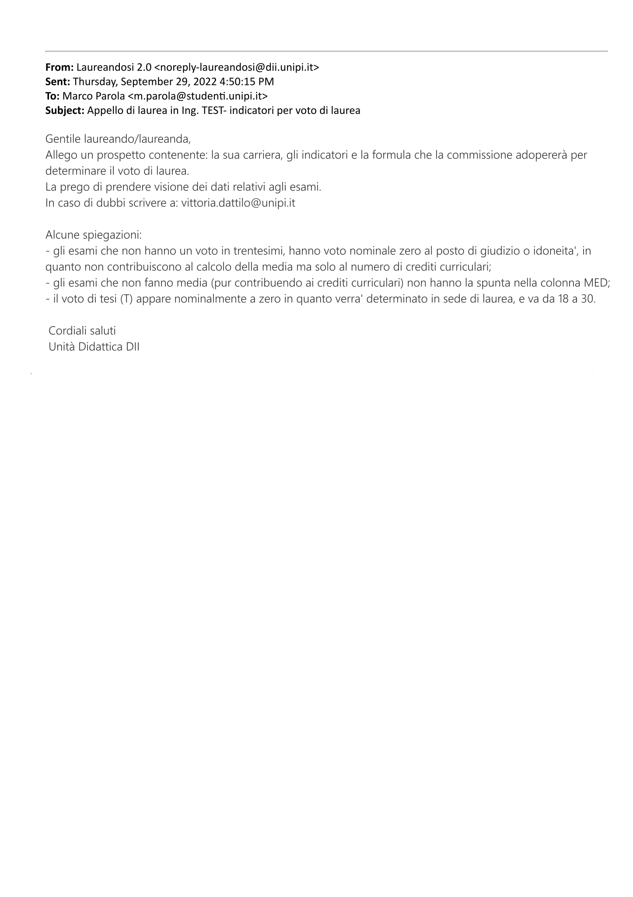

## Figura 5
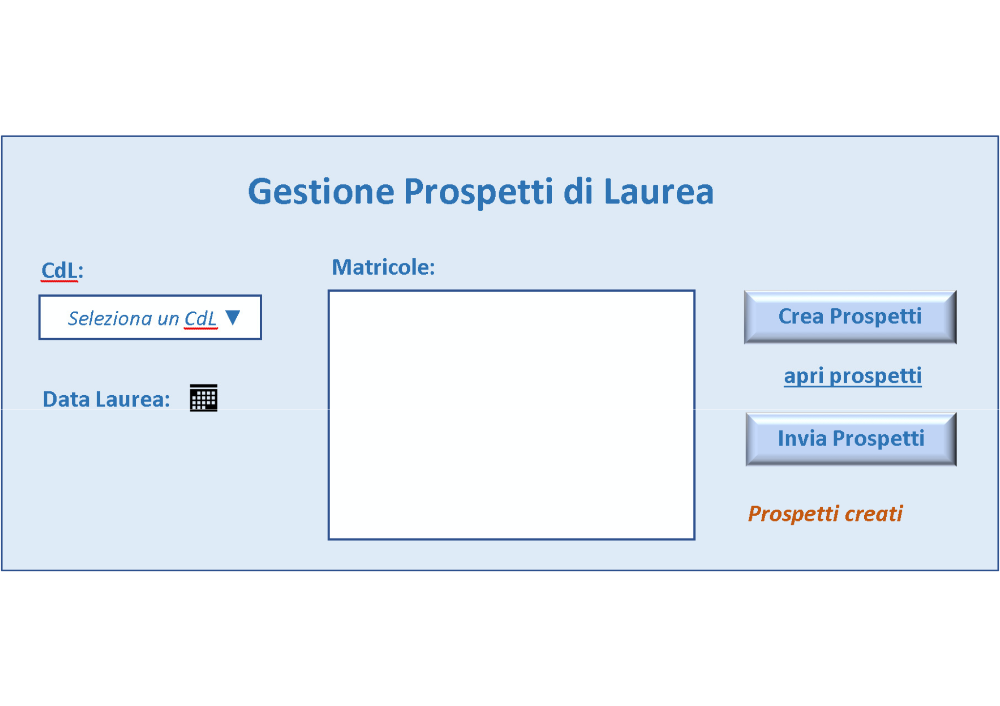

# Figura 6

---

# Workflow Analisi

## Casi d’uso dell’Unità Didattica

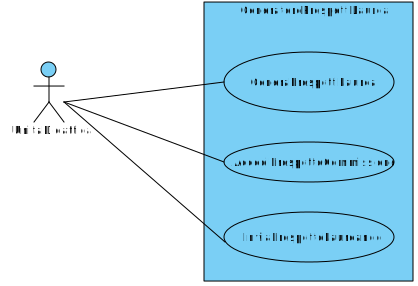

### GeneraProspettiLaurea

- **Scenario**:
  1. **UnitaDidattica** seleziona il **CdL**
  2. _SYSTEM_ mostra il **CdL** selezionato
  3. **UnitaDidattica** seleziona la **Data Laurea**
  4. _SYSTEM_ mostra la **Data Laurea** selezionata
  5. **UnitaDidattica** inserisce la sequenza di matricole dei laureandi separate da virgole e/o spazi
  6. _SYSTEM_ mostra la sequenza di matricole inserite
  7. **UnitaDidattica** clicca sul pulsante **Genera Prospetti**
  8. _SYSTEM_ Azzera tutti i campi e visualizza il messaggio **"Prospetti Creati"**

- **PostCondizione**: Il sistema ha generato in una cartella dal nome corto i prospetti di laurea per la commissione e per i laureandi

### AccediProspettoCommissione

- **Precondizione**: Devono essere stati generati dei prospetti per quel CdL precedentemente (GeneraProspettiLaurea). Il browser deve avere un lettore pdf

- **Scenario**:
  1. **UnitaDidattica** seleziona il CdL
  2. _SYSTEM_ mostra il CdL selezionato
  3. **UnitaDidattica** clicca su Apri Prospetti
  4. _SYSTEM_ Azzera i campi e mostra il messaggio "Prospetti Aperti in un'altra pagina"

- **Postcondizione**: L’attore si trova su un'altra schermata del browser

### InviaProspettoLaureando

- **Precondizione**: L’unità didattica ha già generato i prospetti (GeneraProspettiLaurea) e ha anche preso visione e stampato il prospetto commissione (AccediProspettoCommissione)

- **Scenario**:
  1. **UnitaDidattica** seleziona il CdL
  2. _SYSTEM_ mostra il CdL selezionato
  3. **UnitaDidattica** clicca sul pulsante Invia Prospetti
  4. _for each_ prospetto laureando
     1. _if_ il prospetto è stato correttamente inviato
        1. _SYSTEM_ visualizza il messaggio "inviato prospetto n° X di TOT"
		2. Attende 13 secondi
     2. _else_
		1. _SYSTEM_ visualizza il messaggio "Errore invio prospetto n° X di TOT"
		2. _exit loop_
     3. _end if_
  5. _end for each_

- **Postcondizione**: Il Sistema ha svuotato la cartella dei prospetti laureandi

---

## Classi di Analisi

### Analisi CRC

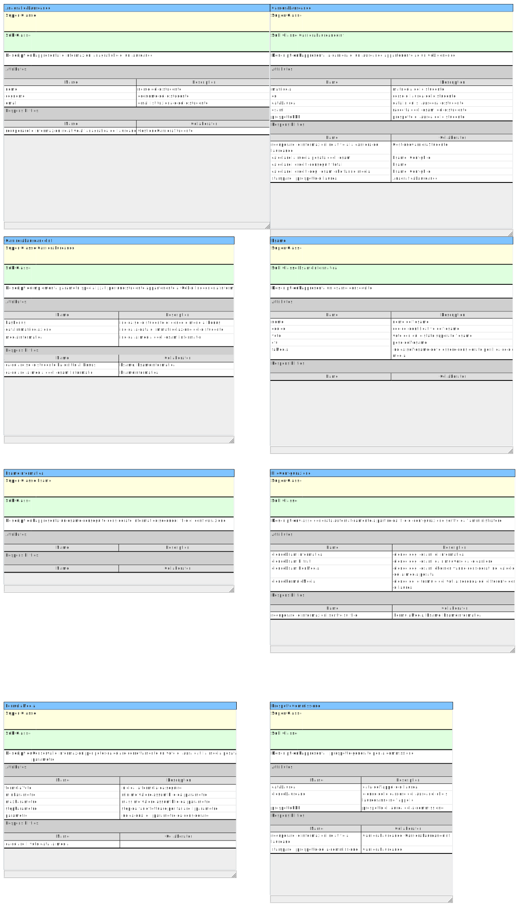

### Diagramma di Classe

I colori indicano il tipo di classe:
- Verde: classi di supporto già fornite da PHP e/o servizi terzi
- Grigio: classi dinamiche generate dinamicamente da file JSON presenti nel sistema
- Blu: classi da creare

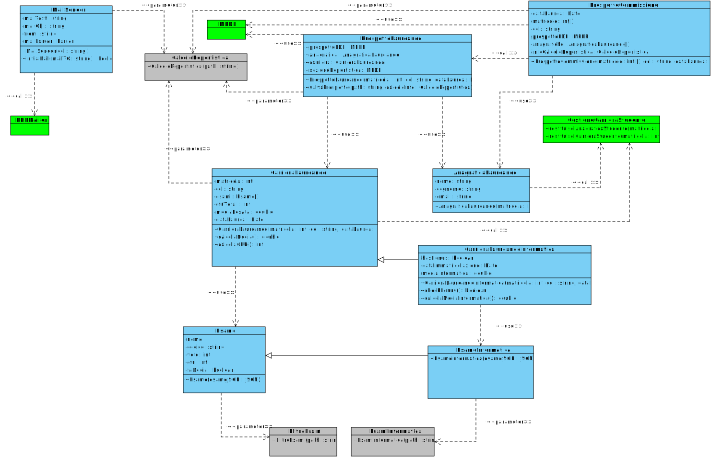

## Realizzazione Casi d’uso di Analisi

### Diagramma di Sequenza GeneraProspettiLaurea

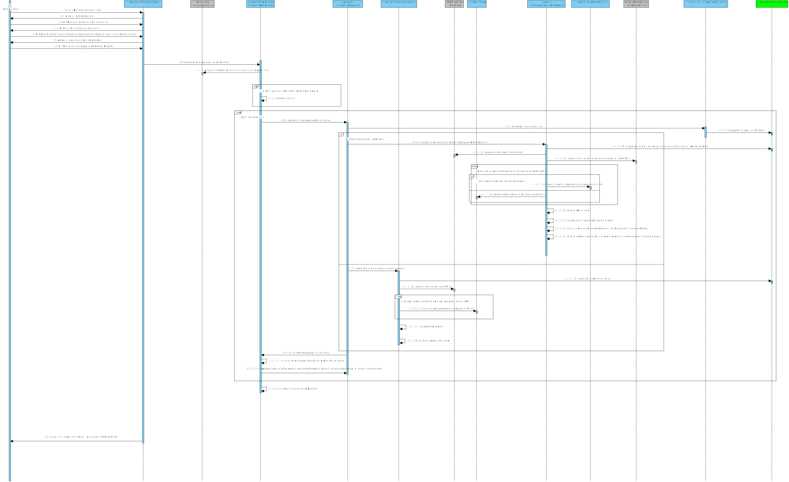

### Diagramma di Sequenza AccediProspettoLaureando

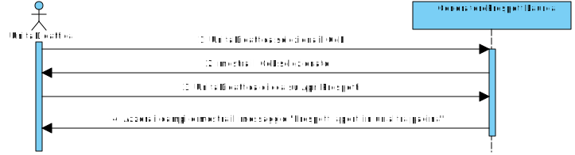

### Diagramma di Sequenza InviaProspettoLaureando

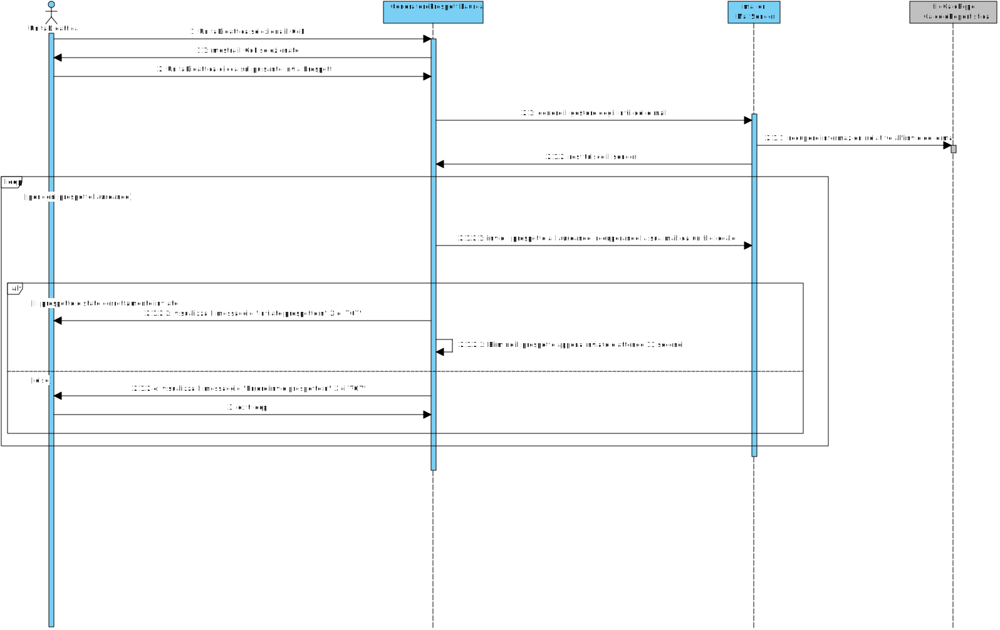

---

# Workflow Progetto

## Diagramma di Classe di progetto

## Realizzazione Casi d’uso di progetto

### Diagramma di Sequenza GeneraProspettiLaurea

#### Diagramma 1

#### Diagramma 2

#### Diagramma 3

#### Diagramma 4

#### Diagramma 5

#### Diagramma 6

#### Diagramma 7

### Diagramma di Sequenza AccediProspettiLaurea

### Diagramma di Sequenza InviaProspettiLaurea

---

# Workflow Implementazione

## Diagramma di dislocazione

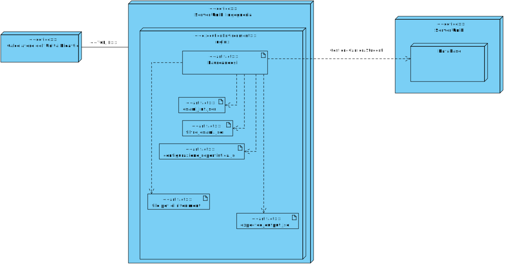

---

# Manuali

## Manuale Utente

"Generatore Prospetti di Laurea" è uno strumento che permette di generare in modo automatico i prospetti di laurea per i laureandi e per la commissione.

Per generare i prospetti desiderati recarsi alla pagina del servizio all’indirizzo impostato dall’amministratore di sistema.

Verrà visualizzata la seguente pagina:

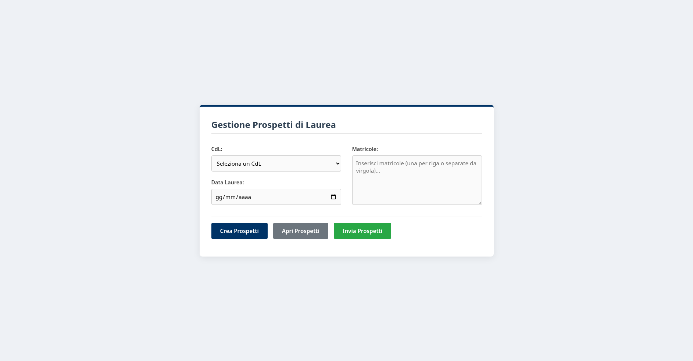

A questo punto è possibile effettuare tre azioni:

- **Generare dei Prospetti**: è necessario inserire il campo **CdL**, la **Data Laurea** e una o più **matricole** (possono essere separate da spazi virgole o essere inserite una per riga). Successivamente cliccare sul pulsante **Crea Prospetti**
- **Aprire i Prospetti precedentemente generati**: è sufficiente inserire il campo **CdL** che indicherà quale prospetto si vuole aprire. Nel caso in cui il browser dovesse bloccare l’operazione di aprire una nuova scheda verrà visualizzato un popup che chiederà di aprirli nella schermata attuale.
- **Inviare agli studenti i propri prospetti dopo averli generati**: è sufficiente inserire il campo **CdL** che indicherà quali prospetti si vuole inviare. Verrà visualizzato un messaggio di standby e si dovrà attendere del tempo per l’invio. In caso di successo l’invio di un prospetto richiede circa poco più di una decina di secondi.

## Manuale Installazione

Per installare il programma sul proprio ambiente WordPress aprire la directory e posizionare il seguente progetto all’interno della root directory del progetto con il nome che si preferisce.

A questo punto scaricare l’estensione "**Insert PHP Code Snippet**" di _xyzscripts.com_ e abilitarla.

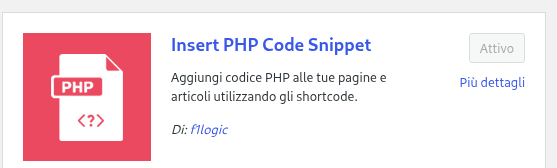

Successivamente creare un nuovo "**PHP Code Snippet**" con i seguenti parametri:

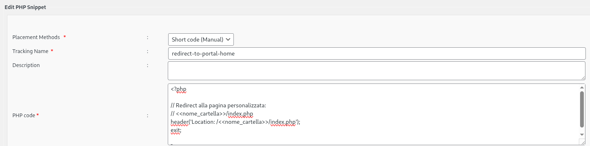

Creato lo snippet aprire la sezione pagine di WordPress e selezionare la Main Page del proprio progetto.
Inserire in cima alla pagina un nuovo blocco "ShortCode" e inserire il nome dello snippet precedentemente creato.

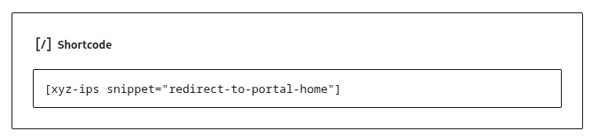

A questo punto il progetto verrà caricato correttamente all’apertura della landing page che effettuerà il redirect automatico nella nuova pagina.

## Manuale di Configurazione

I file di configurazione si trovano nella cartella config del sistema.

Al suo interno si trovano tre file:

### `calcolo_reportistica.json`

In questo file si trovano informazioni relativi ai corsi e ai parametri che il sistema utilizza per il suo funzionamento.

Ogni corso è così strutturato:

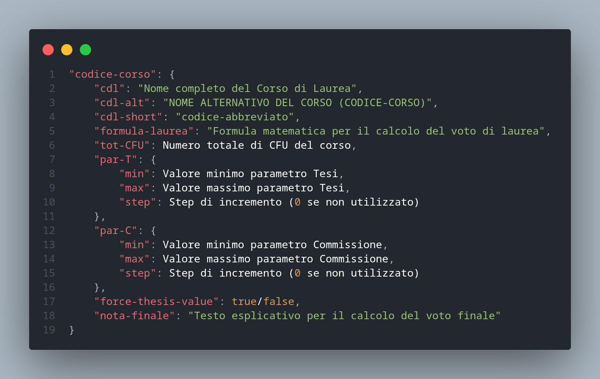

Il sistema interpreta quale dei due parametri (`par-T` o `par-C`) utilizzare a seconda di quale possiede step uguale a 0.

Il sistema è in grado di sostituire automaticamente le stringhe "**MIN**" e "**MAX**" presenti nel campo nota-finale con i valori di minimo e massimo del parametro inutilizzato (quello con `step = 0` nell'altro parametro).

**Esempio**: Se un corso usa solo `par-C` (`par-T.step = 0`), nella nota-finale "**MIN**" e "**MAX**" saranno sostituiti con i valori di `par-T.min` e `par-T.max`

Il campo `force-thesis-value` è utilizzato per imporre al sistema di aggiungere la voce "**Voto di tesi (T):**" nel report del laureando, anche quando il voto di tesi potrebbe non essere un parametro variabile nella formula.

Nella formula di laurea questi sono i significati delle lettere:
- **M**: Indica la media pesata dello studente
- **T**: Indica il voto di tesi
- **C**: Indica il voto commissione
- **CFU**: Indica i CFU che fanno media

Nella sezione `email` invece sono presenti i campi relativi all’invio delle mail:

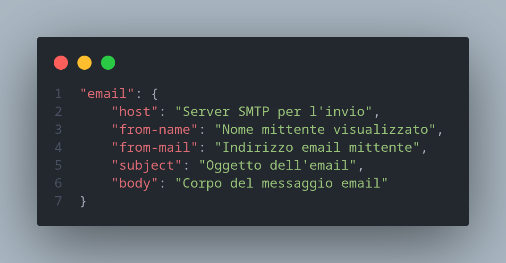

### `filtro_esami.json`

In questo file si trovano le regole di filtraggio per gli esami degli studenti. Il sistema utilizza questi filtri per determinare quali esami devono essere esclusi dal calcolo della media e quali non devono essere considerati nel conteggio dei CFU curriculari.

Il file è organizzato in tre sezioni principali:

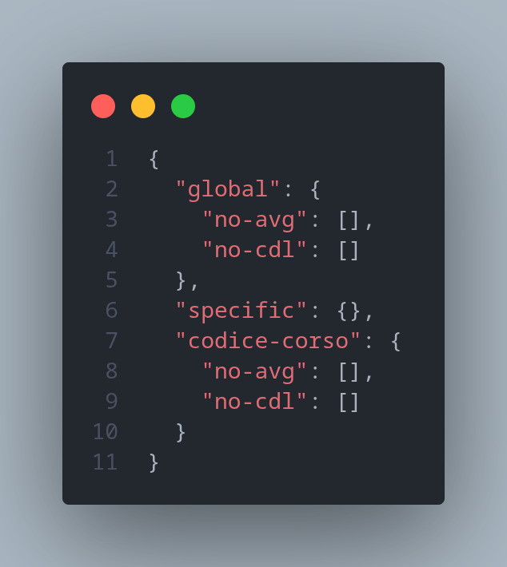

Per ogni sezione sono definiti due campi
- **no-avg**: Array di nomi di esami (case-sensitive) che non fanno media. Questi esami **contribuiscono comunque ai CFU curriculari**. Non però vengono considerati nel calcolo della media pesata. Nel prospetto finale vengono visualizzati **senza la spunta nella colonna MED**
- **no-cdl**: Array di nomi di esami (case-sensitive) che non contribuiscono ai CFU curriculari. Non appaiano nel prospetto finale

La sezione `global` contiene i filtri applicati a **tutti gli studenti** di tutti i corsi di laurea.

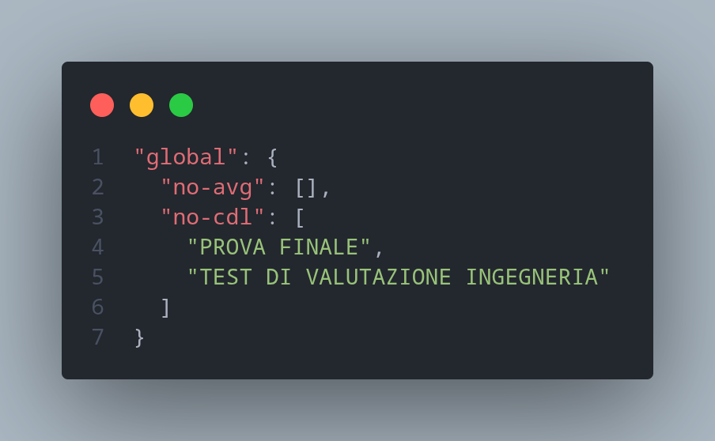

Nella sezione `specific` invece sono contenuti i filtri personalizzati per singoli studenti identificati dalla matricola, come nell’esempio di seguito:

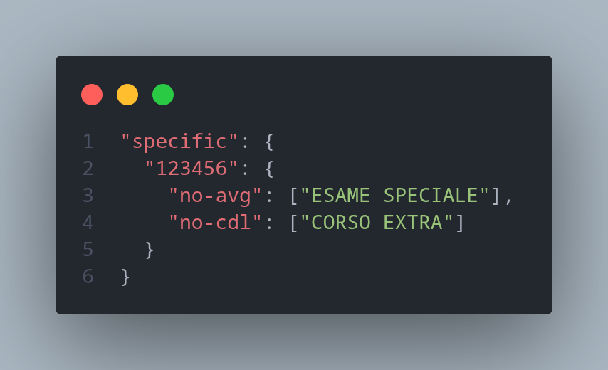

Infine, ogni corso di laurea ha la propria sezione identificata dal proprio codice breve.

Quando il sistema calcola i filtri per uno studente appartenente ad un corso di laurea lo fa sommando i vari filtri: `Filtro finale = global + filtri_corso + filtri_matricola_specifica`

### `esami_inf.json`

In questo file si trova la lista degli esami considerati esami di informatica per il calcolo della media informatica degli studenti dei corsi di Ingegneria Informatica.

Il file ha una struttura molto semplice:

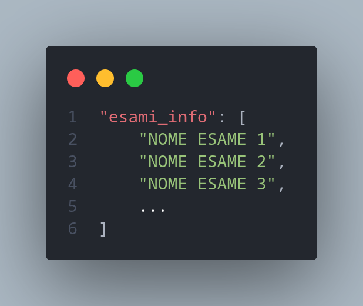

## Manuale di Test

Per testare il programma è possibile accedere alla pagina test aggiungendo la stringa `?test` alla fine dell’URL della pagina.

Ad esempio, se la pagina è raggiungibile all’indirizzo `https://www.example.com/laureandosi/` è possibile accedere alla pagina test all'indirizzo `https://www.example.com/laureandosi/?test`.

In questa pagina è possibile testare le funzionalità del programma.

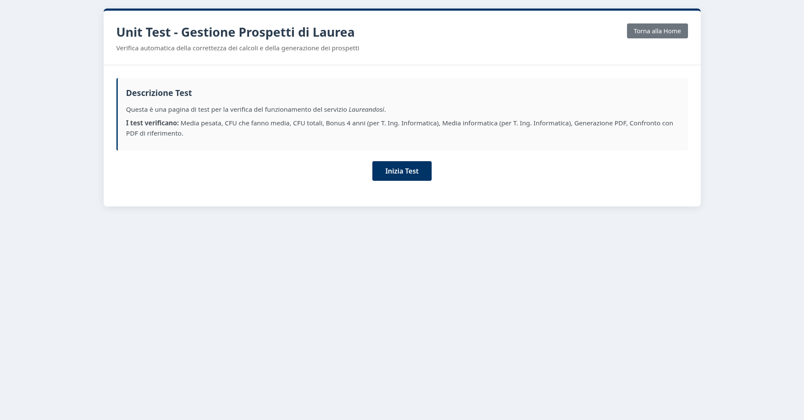

Per far partire i test è sufficiente cliccare il pulsante **Inizia Test**. Verrà quindi visualizzata una tabella che mostra l’esito dei test. Inoltre, nell’ultima colonna è possibile aprire il prospetto generato e quello di riferimento per permettere un confronto visivo.
I pdf di riferimento vanno inseriti nella cartella `test/references`

In fondo alla pagina è mostrata l’opzione di poter testare l’invio dei prospetti via mail. Il prospetto verrà generato rispetto alla matricola default indicata nel file `expected_output.json` della medesima cartella.

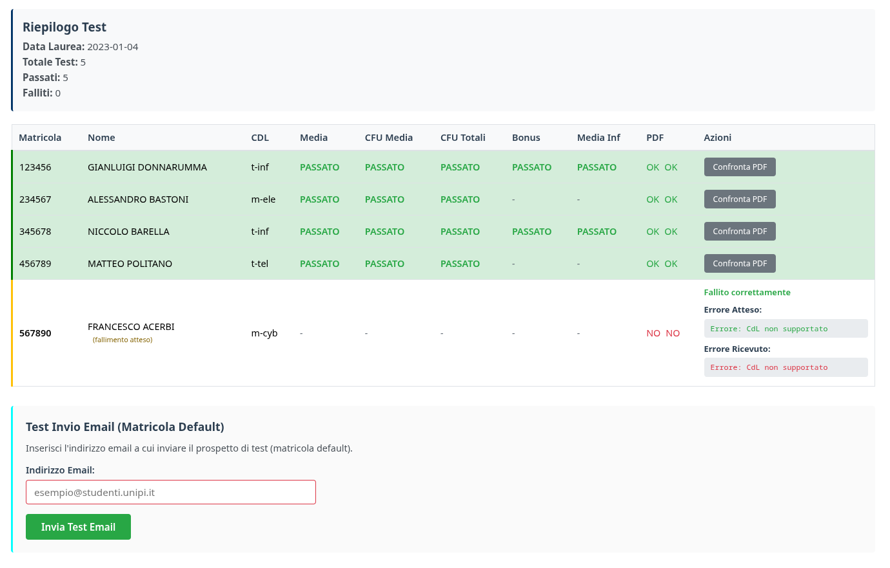

### expected_output.json

Questo file contiene i **dati di test** e i **risultati attesi** per verificare il corretto funzionamento del sistema di generazione dei prospetti di laurea. Viene utilizzato dalla classe `UnitTest` per eseguire test automatici su matricole di esempio.

Il file è organizzato in due sezioni principali:

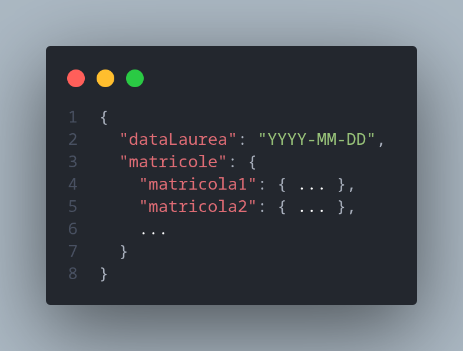

Il formato dei test standard è il seguente:

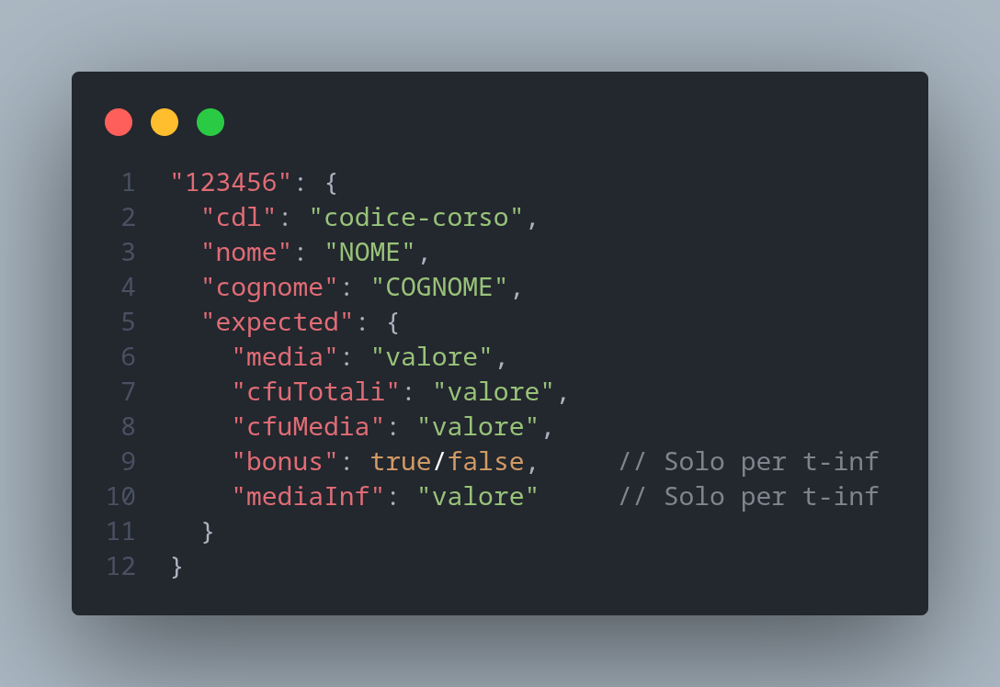

La classe che gestisce i test è in grado di gestire anche i test che verificano che il sistema restituisca gli errori corretti.

In quel caso il formato è il seguente:

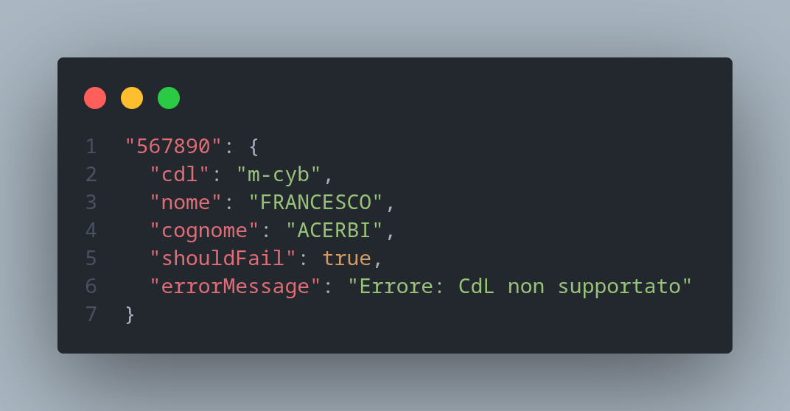

**Nota**: quest'ultima scelta è stata criticata dal professore
